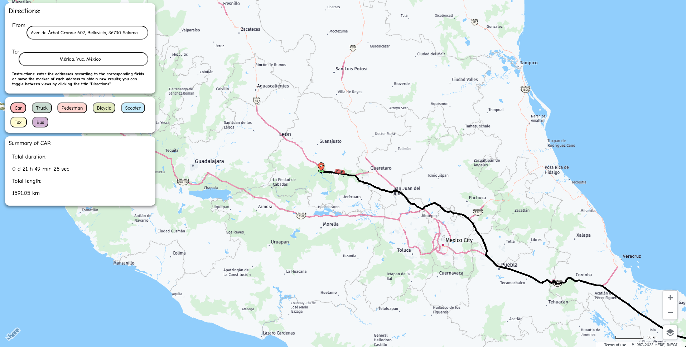
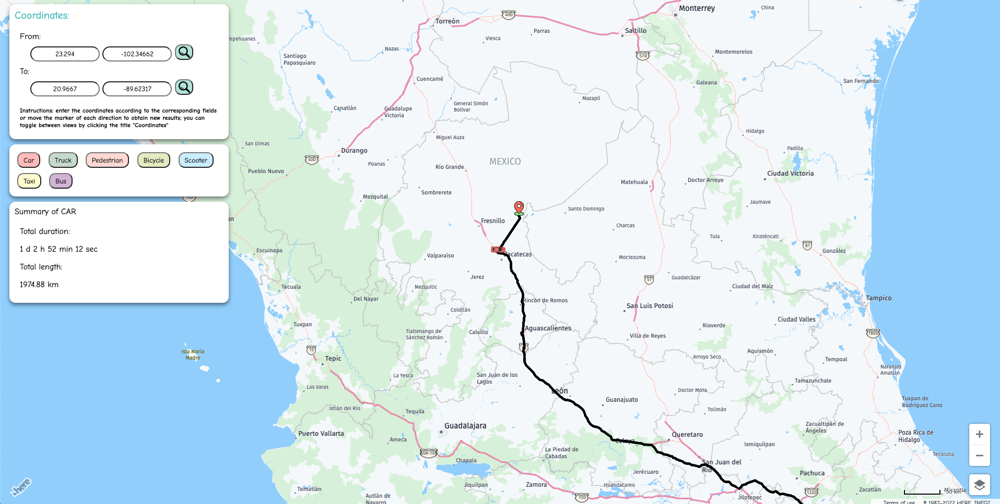

# Turn-by-Turn navigation demo
Project made using the HERE JS API v3.1 in which you can draw a route and navigate according to the desired transport on the map.

The following REST APIs were used to carry out this project:

- [HERE Geocoding & Search API v7](https://developer.here.com/documentation/geocoding-search-api/api-reference-swagger.html)
  - Geocode
  - Reverse Geocode
  - Lookup By ID

*Example image using directions*

*Example image using coordinates*